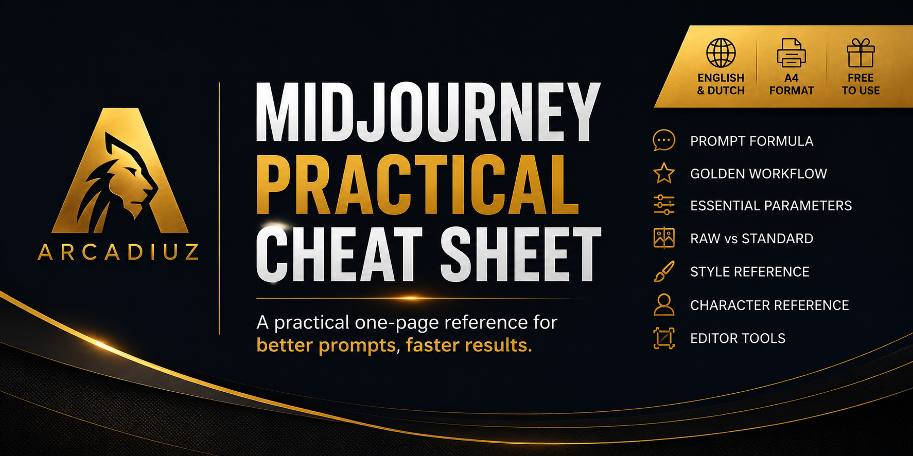
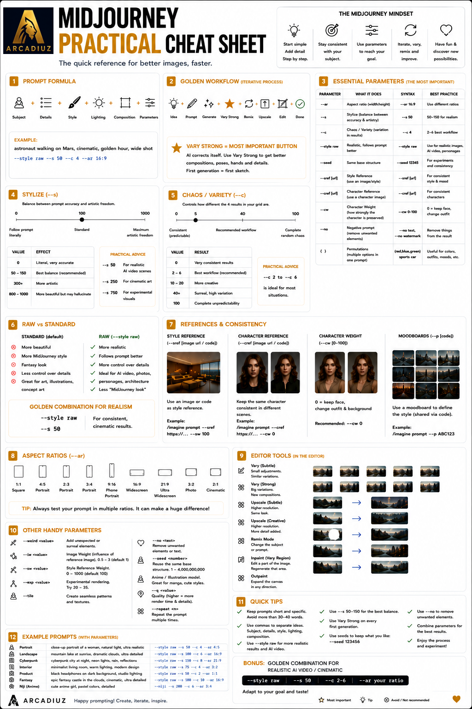
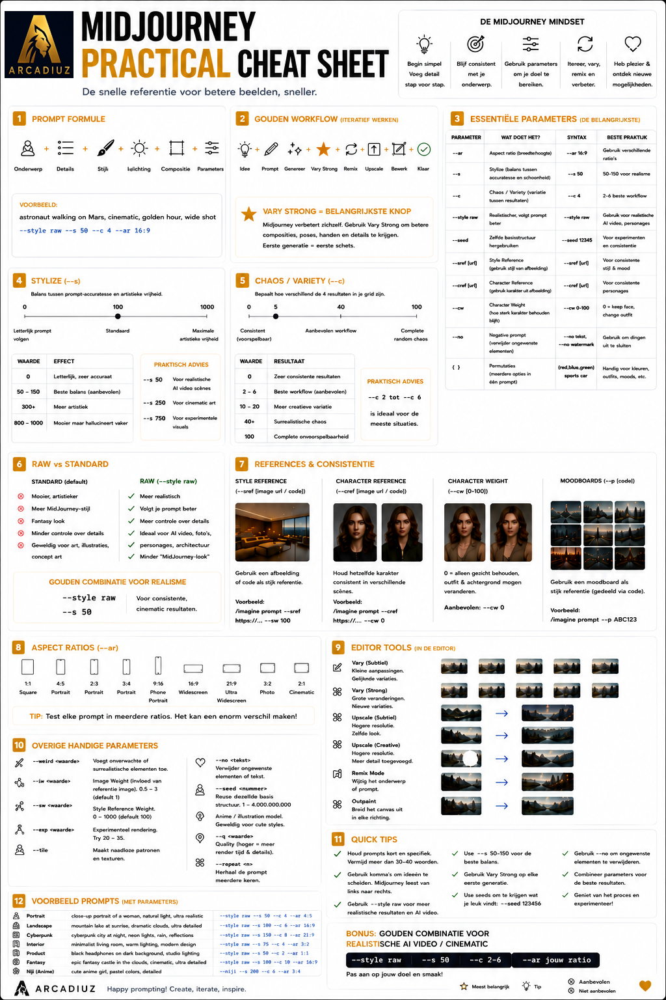

# MidJourney Practical Cheat Sheet

> **A modern one-page reference for MidJourney users, focused on practical workflows instead of overwhelming documentation.**

---

## 📖 Why I Created This Cheat Sheet

I recently started learning **MidJourney** and quickly noticed that most available cheat sheets were either:

- Outdated
- Too focused on listing parameters
- Missing modern workflows
- Overwhelming for beginners

So I decided to create my own.

Instead of documenting every available feature, I wanted to build a practical one-page reference that focuses on the settings, tools and workflows you'll actually use while creating images.

The result is this **MidJourney Practical Cheat Sheet**.

Whether you're just getting started with MidJourney or you're looking for a quick reference while prompting, I hope this guide helps you create better images faster.

---

# ✨ What's Included

This cheat sheet combines the most useful MidJourney concepts into a single printable reference.

Included are:

- 🧠 Prompt Formula
- ⭐ Golden Workflow
- ⚙️ Essential Parameters
- 🎨 Stylize
- 🎲 Chaos / Variety
- 🖼️ Raw vs Standard
- 🎭 Style Reference
- 👤 Character Reference
- 🛠️ Editor Tools
- 📐 Aspect Ratios
- 💡 Practical Tips & Best Practices

---

# 🌍 Available Versions

## 🇬🇧 English

---

## 🇳🇱 Dutch

---

# 🎯 Project Goal

This cheat sheet is **not intended to replace the official MidJourney documentation**.

Instead, it focuses on the techniques you'll actually use every day.

Rather than trying to cover every feature, it emphasizes practical workflows that help you create better images more consistently.

The goal is simple:

> **Create better images, faster.**

---

# 👥 Who Is It For?

This guide is designed for:

- Beginners learning MidJourney
- Prompt Engineers
- AI Artists
- Designers
- Content Creators
- AI Consultants
- Anyone looking for a practical MidJourney reference

---

# 🚀 Features

- ✅ One-page A4 layout
- ✅ Print friendly
- ✅ Beginner friendly
- ✅ Practical instead of theoretical
- ✅ Covers modern MidJourney workflows
- ✅ English & Dutch editions
- ✅ Free to use

---

# 💡 Why This Cheat Sheet Is Different

Many cheat sheets focus almost entirely on documenting parameters.

This one focuses on **how to actually work with MidJourney**.

It teaches practical concepts such as:

- Building prompts step by step
- Working iteratively
- Using **Vary Strong**
- Understanding **Stylize** and **Chaos**
- Knowing when to use **Raw Mode**
- Creating consistent characters
- Maintaining a consistent visual style
- Building an efficient prompting workflow

It's designed to become a practical reference that stays beside your keyboard while creating images.

---

# ❤️ Contributing

Found something that could be improved?

Feel free to:

- Open an Issue
- Submit a Pull Request
- Share ideas for future versions

Feedback is always welcome.

---

# ☕ About the Author

Hi! I'm **Maarten Delissen**, founder of **Arcadiuz**.

I'm passionate about Microsoft AI, Prompt Engineering, AI Agents and Generative AI.

I enjoy creating practical learning resources that simplify complex topics and help others learn faster.

This cheat sheet is part of my own learning journey, and I hope it helps others as well.

---

# 📜 License

This project is licensed under the **Creative Commons Attribution 4.0 International (CC BY 4.0)** License.

You are free to use, print, share and adapt this cheat sheet, provided that appropriate credit is given.

For the full license text, see the LICENSE file or visit:

https://creativecommons.org/licenses/by/4.0/

---

# ❤️ Support

If this cheat sheet helped you, please consider:

⭐ Starring this repository

🐛 Opening an Issue if you spot an error

💡 Suggesting improvements

Every contribution helps make this cheat sheet even better.

Happy prompting! 🚀
